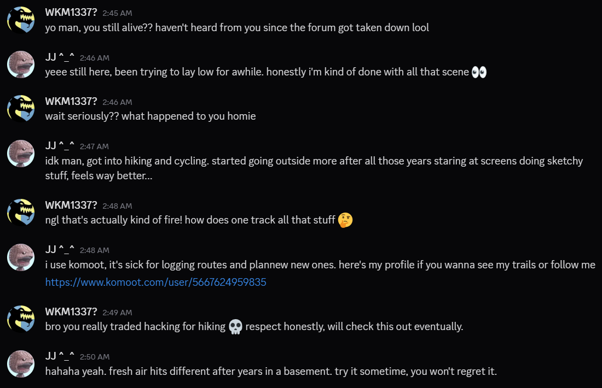
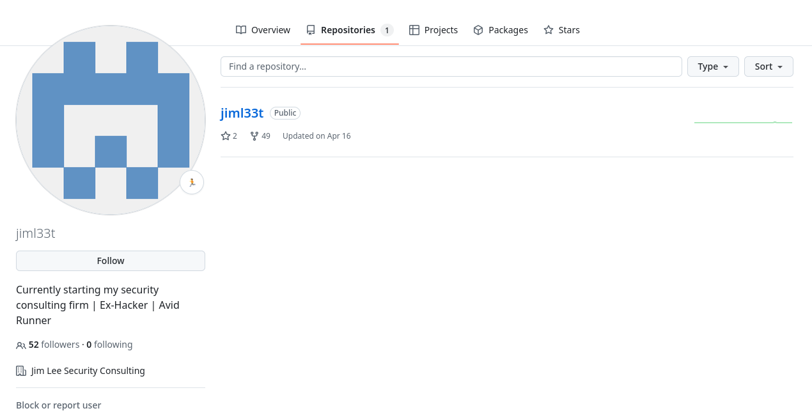
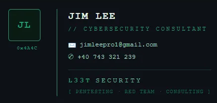
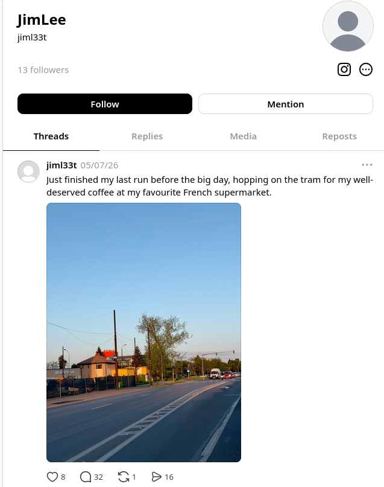

# Cache Me Outside
___

**Category**: _Active OSINT_

> In the real world, interacting with discovered infrastructure or accounts can be risky, may alert the target, and should only be done with proper authorisation. For this room, the interaction and response are part of the controlled challenge setup.
___

## Background
A retired hacker has had parts of his identity scattered across the open internet, and what starts as a leaked screenshot reveals hidden clues. The connected details show the trail was intentionally set up to get him found.


## Evidence


From this conversation, it can be extracted the url leading to hacker's public profile [https://www.komoot.com/user/5667624959835](https://www.komoot.com/user/5667624959835).


## Assignments

### What is the retired hacker’s full name?

- Opening the previous attached link it leads to Jim Lee's komoot page.


- Answer: _Jim Lee_


### What email address did he accidentally expose?

- From the anterior picture, there is a github url which leads to Jim Lee's github profile [https://github.com/jiml33t](https://github.com/jiml33t).
- Opening the page, there is only one public repository which could contain a leaked email address in its git logs.



- Clone the repository, and check the git logs with the following command:

```bash
$ git log       
commit 7b2c8e0a540c36f2e09da5945066020621d6a059 (HEAD -> main, origin/main, origin/HEAD)
Author: jimleepro1-cell <jimleepro1@gmail.com>
Date:   Thu Apr 16 03:27:19 2026 -0400

    Initial commit
```

- Answer: _jimleepro1@gmail.com_

### What is his phone number?

- Send an email to hacker's email address and the response is a default out-of-office template. 
- The phone number is presented in the attached picture below, which was extracted from the email body.
- The _+40_ is the prefix of a Romanian phone number.



- Answer: _+40 743 321 239_

### In which city is he located?
- Use the username from github _jiml33t_ to discover more public profiles which could leads to a picture or something related that can give its location.
- On the Threads app Jim Lee recently posted a picture:



- Using the name of the company *IRIGATII.RO* and its contact page, with the blue sign transportation, the location is Timisoara, Romania.

-Answer: _Timișoara_

### Submit the name of the tram station where he got off on the 7th of May, 2026.

- The previous picture was taken on the 7th of May, 2026 from the Threads App. 
- "French supermarket" indicated a popular store in Romania, namely Auchan.
- With Google Maps, search for Auchan Timisoara and select the transportation view.
- The only result which includes a store Auchan near to a tram station is station in AEM, where tram number 4, 6 and 9 are leading.
- Answer: _Piața Gheorghe Domășneanu_
