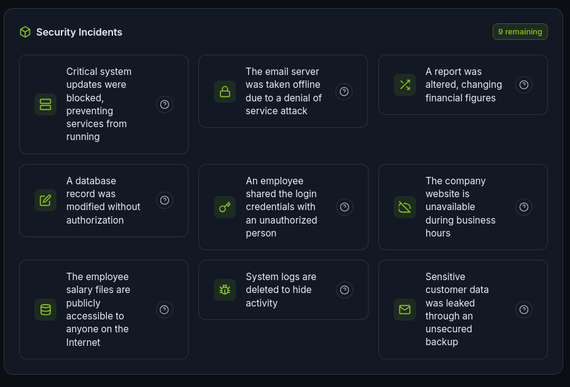
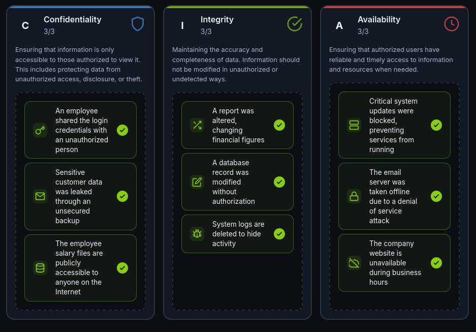

# The CIA Triad
> This walkthrough guides us into the CIA Triad and the *Security Mindset*

# Here is how I dealt with the hands-on scenario

I am given a list of nine different security incidents and I must determine which part of the CIA triad is being affected by them.

> (left -> right)

1. When critical services are blocked resulting in systems being down this a matter of **Availability**, due to lack of running resources for the business.
2. DOS attack is a type of attack when attacks overwhelm a system with insane amounts of requests or by vulnerability exploitation. To sum up, it is an issue for **Availability**.
3. When data is being altered without authorization it takes part of **Integrity**.
4. Database acces and modification without authorization it is a major security concern for
**Integrity**.
5. The main source of information leakage is through employees, since it only take one weak link for **Confidentiality** issues.
6. When a online resource is unavailable, it was taken down due to an attack. Should be considered as an **Availability** concern.

