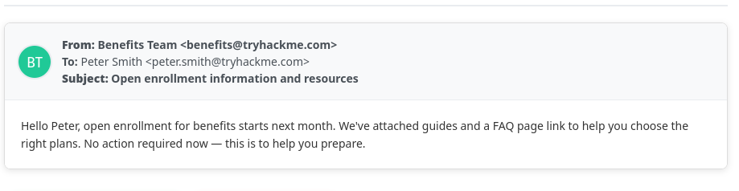
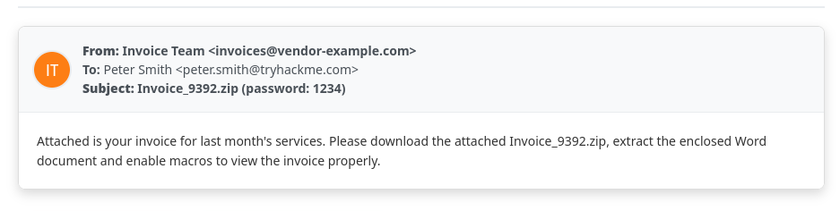
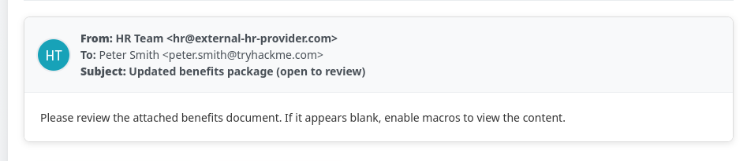
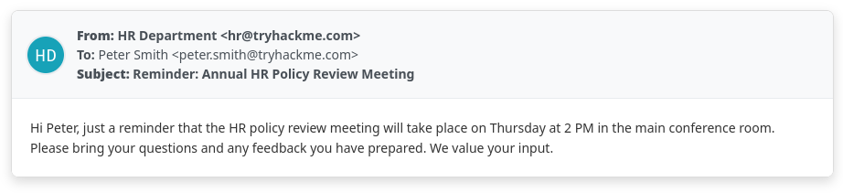
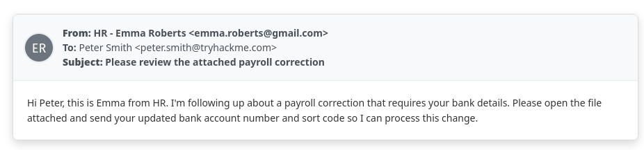
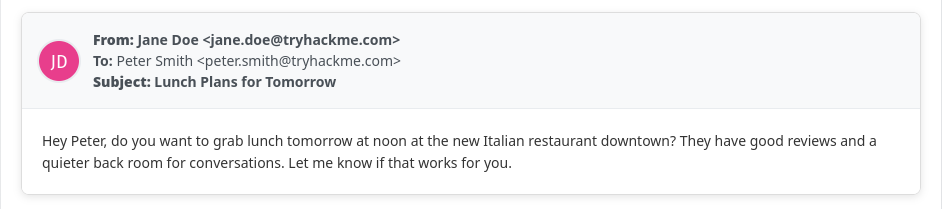
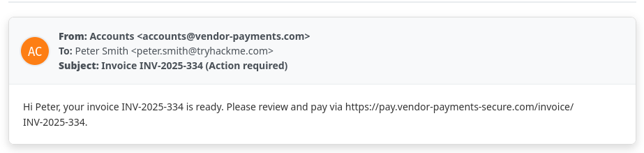
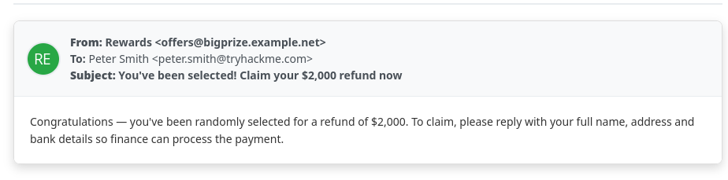
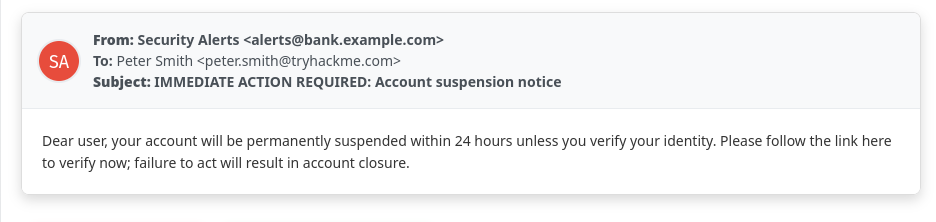
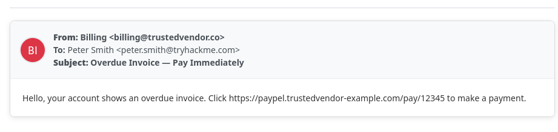

# The Phishing Pond

> This challenge presents a list of emails and I will be required to identify wheather they are phishing emails or not.

## Here is how I tackled this assignment:

The first step is always observation of emails. I checked for the following clues in their email addresses:
- *Look-alike sender addresses*: such as g00gle.com instead of google.com, rnicrosoft.com instead of microsoft.com  
- *Impersonation*: when the display name of sender is familiar, but the domain name doesn't match with the company's domain.

Moreover I jump into the content of the email to investigate further for:
- *Scare tactics, urgency, immediate actions*: these keywords lead to a possible phishing email as to distrub the receiver by its sense of urgency and fall into the trap.
- *Ridiculously implausible offers*: big prizes, huge discounts, mega deals, high paying job opportunities which all have one thing in common. Sharing sensitive information.
- *Malicious attachments*:  different file types DOC, XLS, ZIP asking you to “enable macros” or containing malware.

## Hands-on

> It is a legitimate email.

:x: **PHISHING**
---

> Email contains an **attachment** and the sender asks us to **enable macros**.

:white_check_mark: **PHISHING**
---

> The sender requests us to **enable macros** to "review the attachment".

:white_check_mark: **PHISHING**
---

> It is a legitimate email from the HR departament informing the receiver about a meeting on Thursday at 14:00.

:x: **PHISHING**
---

---

---

---

---

---

