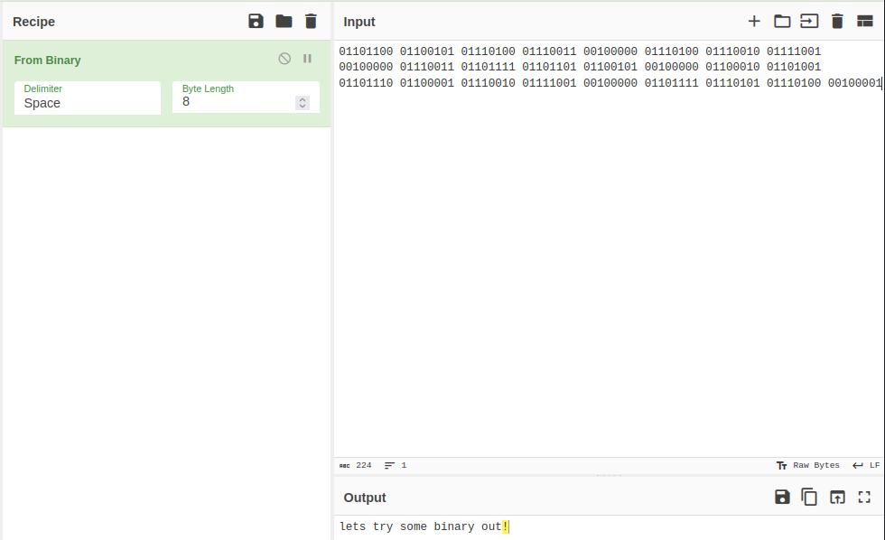
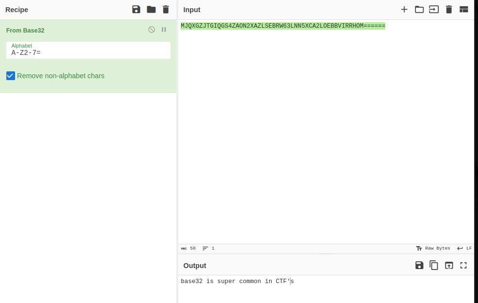
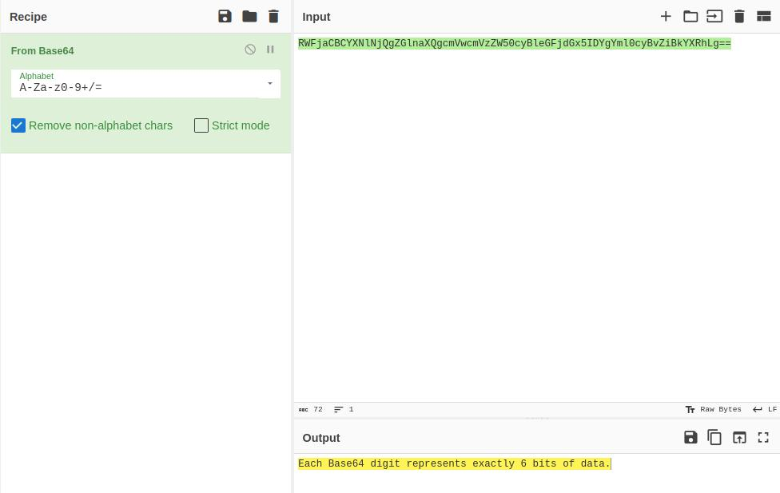
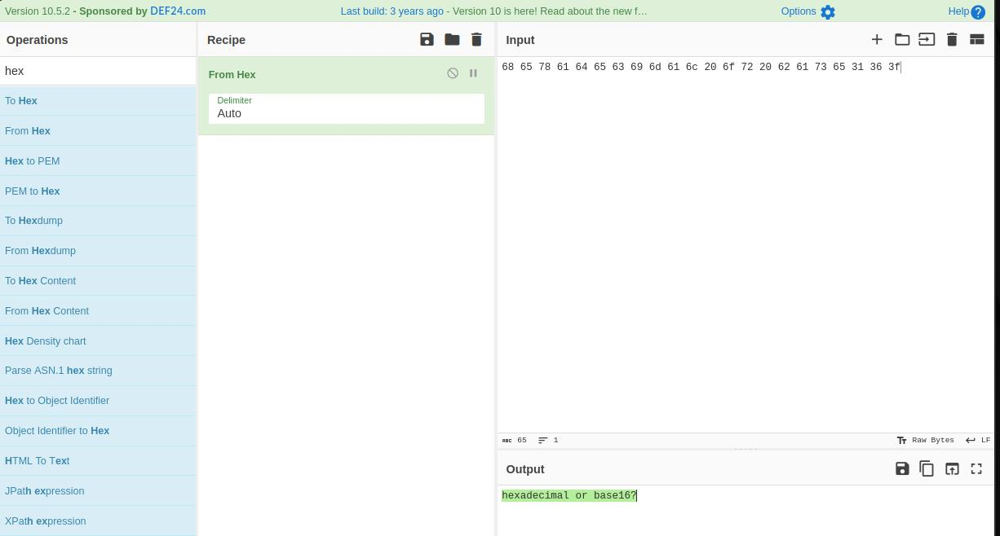
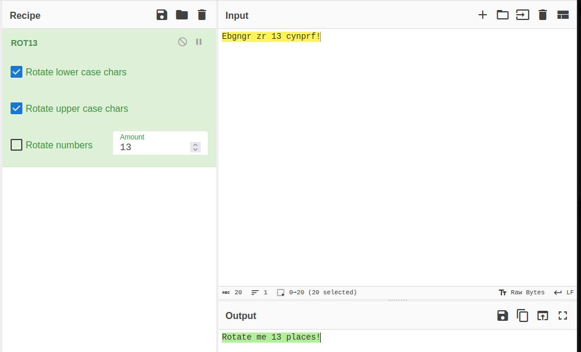
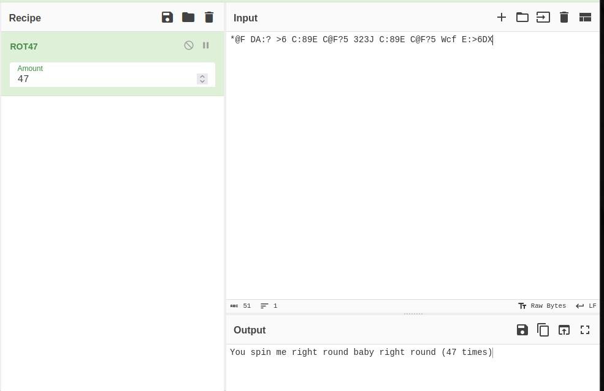
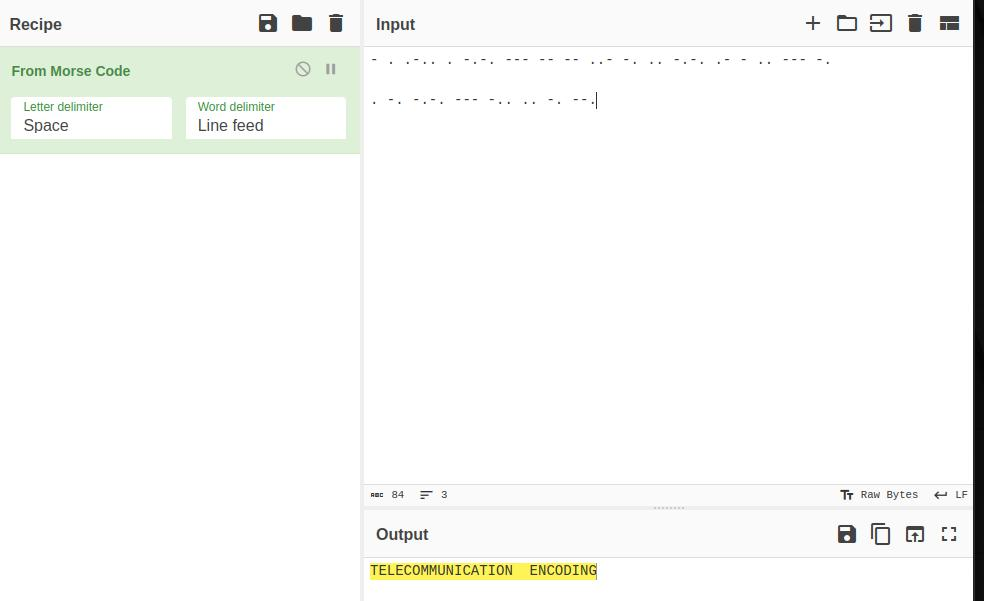
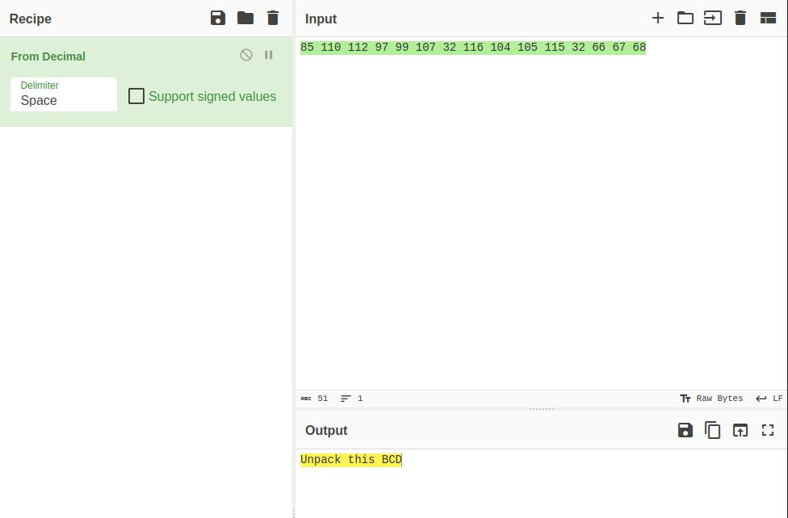
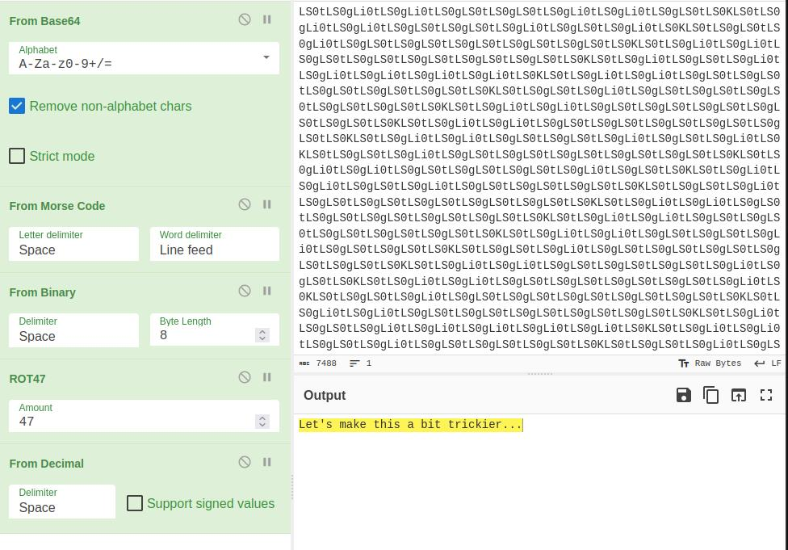
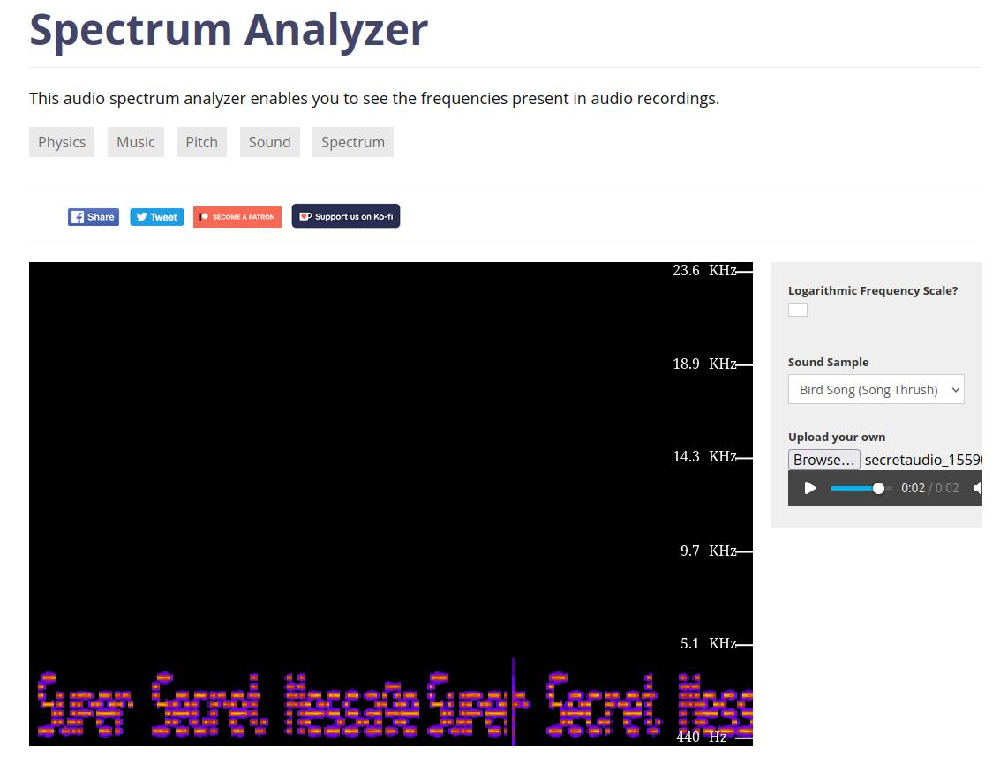

# c4ptur3-th3-fl4g

Here is how I tackled this challenge:

------

## Task 1: Translation & shifting

> [!NOTE]
>
> Translate, shift and decode the following; Answers are all case sensitive.

### 1) c4n y0u c4p7u23 7h3 f149?

- the text is altered through text obfuscation 
- the answer is: <u>can you capture the flag?</u>

### 2) 01101100 01100101 01110100 01110011 00100000 01110100 01110010 01111001  00100000 01110011 01101111 01101101 01100101 00100000 01100010 01101001  01101110 01100001 01110010 01111001 00100000 01101111 01110101 01110100  00100001

- I opened cyberchef and pasted this in the input filed and I searched for a recipe of converting binary into text.
- the answer is: <u>lets try some binary out!</u>



### 3) MJQXGZJTGIQGS4ZAON2XAZLSEBRW63LNN5XCA2LOEBBVIRRHOM======

- I recognized this encoding to be in base32, so i pasted the text in cyberchef and selected the **from base 32** recipe
- the answer is: <u>base32 is super common in CTF's</u>



### 4) RWFjaCBCYXNlNjQgZGlnaXQgcmVwcmVzZW50cyBleGFjdGx5IDYgYml0cyBvZiBkYXRhLg==

- This one is encoded in base 64, so again in cyberchef i selected the recipe **from base 64**

- the answer is: <u>Each Base64 digit represents exactly 6 bits of data.</u>

  

### 5) 68 65 78 61 64 65 63 69 6d 61 6c 20 6f 72 20 62 61 73 65 31 36 3f

- This one was given away by the letters in their numeration base, 16. In cyberchef I selected **from hex** recipe.
- the answer is: hexadecimal or base16?



### 6) Ebgngr zr 13 cynprf!

- A bit tricky to find the immediate solution, but I figured the 13 number in the text should represent something
- So I checked on cyberchef for a Caesar cipher with 13 rotations, **ROT 13 **
- the answer is: <u>Rotate me 13 places!</u>



### 7) *@F DA:? >6 C:89E C@F?5 323J C:89E C@F?5 Wcf E:>6DX

- This one was trial and error, with emphasis on a rotational algorithm, due to the length of words and overall appeal:

- **ROT 47** saved the day for this one.

- the answer is: <u>You spin me right round baby right round (47 times)</u>

  

### 8) \- . .-.. . -.-. --- -- -- ..- -. .. -.-. .- - .. --- -.

. -. -.-. --- -.. .. -. --.

- Nothing compares to the good days of simple transmission via morse code.
- Cyberchef helps us once more, with the recipe: **From Morse Code**
- the answer is: <u>telecommunication encoding</u>



### 9) 85 110 112 97 99 107 32 116 104 105 115 32 66 67 68

- This is straightforward a decimal base, let us convert it into text via **From Decimal**

- the answer is: <u>Unpack this BCD</u>

  

### 10) LS0tLS0gLi0tLS0g...LS0tLS0gLi0tLS0g (long)

- This one seems daunting at first
- I tried with my friend **Base 64**, and got something interesting: a list of **.-**
- Then morse code decoding resulted in a series of bits → **From Binary**
- The bits are split into something and look like some text, so us try to shake them up **ROT 47**
- Finally the common base 10, we convert it to text: **Fom Decimal**
- the answer is: <u>Let's make this a bit trickier...</u>



## Task 2: spectogram

- I used an on-line tool for spectogram manalysis: https://academo.org/demos/spectrum-analyzer/
- this served the purpose and the answer is: Super Secret Message




## Task 3: Steganography


- The mighty Dino is trapped between pasta curls, let us uncover its mistery.

- I tried exiftool and strings in the CLI, but found nothing worth mentioning.

- However,  with steghide I decided to extract all data from the image:

  ```bash
  steghide extract -sf stegosteg_1559008553457.jpg 
  Enter passphrase: 
  wrote extracted data to "steganopayload2248.txt".
  ```

- well, well we have found something interesting in the payload file:

```bash
cat steganopayload2248.txt 
SpaghettiSteg
```

- and the answer is: <u>SpaghettiSteg</u>

## Task 4: Security through obscurity

- Ah, another image. Let's try to pull the strings out of it:

  ```bash
  strings meme_1559010886025.jpg 
  JFIF
  "Exif
  $3br
  %&'()*456789:CDEFGHIJSTUVWXYZcdefghijstuvwxyz
  ...
  IEND
  "AHH_YOU_FOUND_ME!" 
  hackerchat.png
  ```

- We have found the file: <u>hackerchat.png</u>

- and the hidden text: <u>AHH_YOU_FOUND_ME!</u>